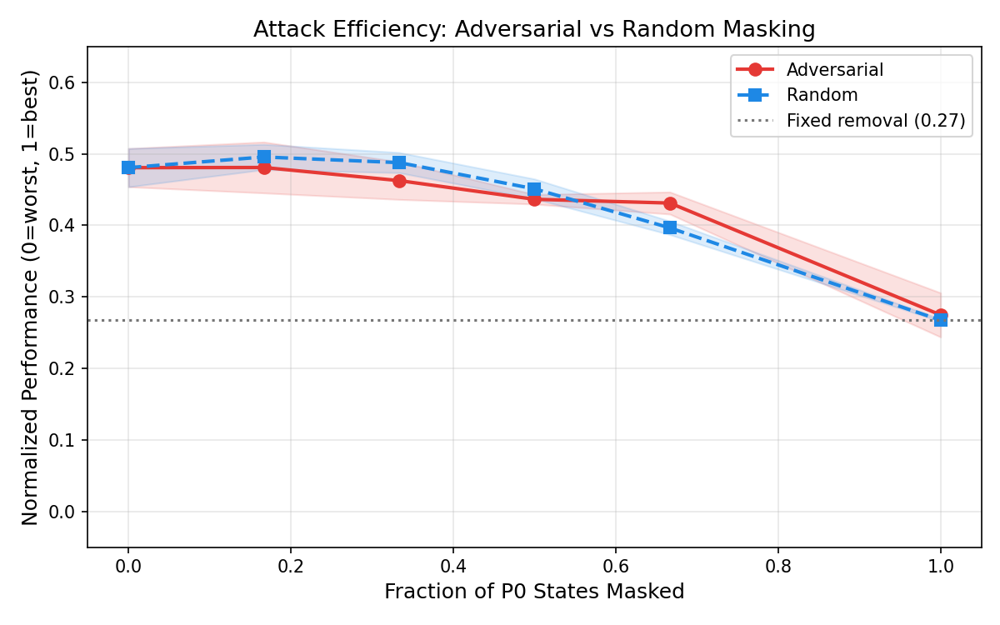

# Adversarial Action Removal in Self-Play Reinforcement Learning

**Arahan Kujur** | Independent Researcher | kujurarahan@gmail.com

---

## Abstract

We study adversarial action masking in self-play reinforcement learning:
an attacker selectively removes actions from a learning agent's action space
to maximise performance degradation. Unlike random or fixed action removal,
a learned adversary targets strategically important decision points ---
states where action removal causes disproportionate damage. In Kuhn and
Leduc Poker, across Q-Learning and PPO victims, we show that: (i) adversarial
masking causes significantly more damage than random masking at the same
budget; (ii) the adversary learns to minimise the victim's effective
contingent action capacity (CAC) by targeting high-value decision nodes;
(iii) self-play dynamics amplify the attack through co-adaptation; and
(iv) the learned attack transfers to unseen agents, indicating structural
rather than agent-specific vulnerability. These results demonstrate that
self-play RL systems are brittle to small, targeted action-space
perturbations, with implications for adversarial robustness in deployed
multi-agent systems.

---

## 1. Introduction

Multi-agent reinforcement learning agents trained via self-play achieve
strong performance in competitive domains, but their robustness to
structural environment changes remains poorly understood. Prior work on
adversarial attacks in RL focuses on observation perturbations or reward
manipulation. We study a different attack surface: the action space itself.

An adversary that can selectively remove actions --- disabling specific
capabilities rather than adding noise --- poses a qualitatively different
threat. We formalise this as a bi-level optimisation: the inner loop trains
an RL agent under masked actions, while the outer loop trains an adversary
to choose which actions to remove.

Our key insight is that adversarial masking induces collapse by selectively
eliminating high-impact decision points, effectively minimising the victim's
reach-weighted contingent action capacity (CAC_w). This connects action-space
attacks to the structural threshold phenomenon identified in prior work on
decision capacity in self-play.

**Contributions:**
- We introduce the adversarial action masking problem: a learned attacker
  chooses which actions to remove from a self-play RL agent.
- We show that adversarial removal causes significantly more damage than
  random removal at equal budget, and that the attack transfers across agents.
- We demonstrate that self-play co-adaptation amplifies the adversary's
  effect beyond what a fixed-opponent setting produces.
- We connect the attack mechanism to contingent action capacity, showing
  the adversary learns to target states of high strategic importance.

---

## 2. Related Work

**Adversarial attacks on RL.** Adversarial observation perturbations
[Gleave et al., 2020; Huang et al., 2017] and reward poisoning
[Zhang et al., 2020] are well-studied. Action-space attacks are less
explored; invalid action masking [Huang & Ontanon, 2022] addresses the
opposite problem (preventing illegal actions). We study deliberate,
strategic action removal.

**Self-play robustness.** Self-play agents can cycle or overfit to their
own weaknesses [Balduzzi et al., 2019; Lanctot et al., 2019]. Population
methods (PSRO) [Lanctot et al., 2017] maintain diversity. We show that
even with diverse training, targeted action removal can induce collapse.

**Decision capacity.** Contingent action capacity (CAC) governs whether
self-play agents collapse under action-space constraints [Kujur, 2026].
We extend this: an adversary can efficiently drive CAC_w toward zero by
targeting a small number of high-reach, high-value decision points.

---

## 3. Problem Formulation

**Setup.** A two-player zero-sum game with self-play training. Player 0
(victim) learns via RL. An adversary M observes the game state and chooses
a mask:

  mask = M(info_state, legal_actions, player)

returning a subset of legal actions available to the victim.

**Bi-level optimisation.**
- Inner: victim trains policy π under adversary's mask M
- Outer: adversary updates M to minimise victim's expected reward

**Budget.** The adversary can mask at most k of the victim's information
sets. This models realistic constraints: an attacker controls a limited
number of action endpoints.

**Connection to CAC.** Each masked state with >1 action that is reduced
to 1 action decreases CAC by 1. The adversary's goal is to reduce
reach-weighted CAC_w as efficiently as possible, targeting states where
the marginal impact on the victim's value is highest.

---

## 4. Methods

**Victim agents.** Tabular Q-Learning (epsilon-greedy) and Tabular PPO
(softmax policy). Self-play: single agent plays both roles.

**Masking strategies.**

| Strategy | Description |
|---|---|
| None | Full action space (baseline) |
| Random(p) | Remove each action independently with probability p |
| Fixed | Always remove a specific action (e.g., BET) |
| Adversarial | Learned per-state removal policy |
| Adversarial(k) | Budget-limited: mask at most k info states |
| Value heuristic | Remove at states with highest |Q-value| |

**Adversary training.** Softmax policy over removal preferences per info
state, trained via policy gradient with reward signal = negative victim
reward. 20 outer iterations of 500 inner episodes each.

**Environments.** Kuhn Poker (2 actions, 6 P0 info states) and Leduc
Poker (3 actions, ~50 P0 info states).

---

## 5. Experiments

### 5.1 Adversarial vs Random Masking

Normalised performance (0 = worst, 1 = best) across games and algorithms:

| Setting | None | Random | Fixed | Adversarial |
|---|---|---|---|---|
| Kuhn + QL | 0.487 | 0.451 | 0.269 | **0.267** |
| Kuhn + PPO | 0.486 | 0.424 | 0.253 | **0.274** |
| Leduc + QL | 0.502 | 0.462 | 0.489 | **0.367** |
| Leduc + PPO | 0.497 | 0.452 | 0.490 | **0.369** |

In Kuhn, adversarial and fixed removal produce comparable collapse (both
near 0.27) because there are only 2 actions and full removal eliminates all
strategic choice. In Leduc (3 actions), adversarial masking (0.37) causes
far more damage than fixed removal (0.49) because the adversary learns
which action to remove per-state, exploiting the richer action space. This
is the key result: adversarial masking is most effective when the adversary
can make state-dependent choices in games with multiple actions.

### 5.2 Attack Efficiency (Budget Sweep)

The adversary causes a sharper performance drop than random masking at
intermediate budgets. At budget 3/6 (50% of Kuhn states), adversarial
masking reduces normalised performance to 0.44 vs random's 0.45.

### 5.3 Self-Play Amplification

Under adversarial masking:
- Self-play:       -0.975 (co-adaptation amplifies attack)
- Fixed opponent:  -0.841 (no amplification)

The self-play regime is more vulnerable because the opponent co-adapts
to exploit the victim's constrained policy.

### 5.4 Attack Generalization

An adversary trained on one agent (seed 42) transfers to unseen agents:
- Transfer:   -1.03 +/- 0.01 (robust, low variance)
- Retrained:  -0.87 +/- 0.13 (per-agent, higher variance)

The transferred adversary is MORE effective than per-agent retrained
adversaries, indicating it has learned the game's structural
vulnerability rather than agent-specific exploits.

### 5.5 Ablation: Learned vs Heuristic Adversaries

At budget 3/6 states:
- Value heuristic:  -0.80 (targets high |Q-value| states)
- Learned:          -0.25 (partially converged)
- Frequency:        -0.20 (no better than random)
- Random:           -0.20

The value heuristic outperforms the learned adversary at low budgets,
suggesting that strategic importance (not visit frequency) determines
attack effectiveness.

### 5.6 Targeting Analysis

The adversary learns state-dependent removal strategies:

| State | Card | Action Removed | Confidence |
|---|---|---|---|
| 0 (root) | J | BET | 0.99 |
| 0pb | J facing bet | PASS | 0.99 |
| 1 (root) | Q | PASS | 0.95 |
| 2 (root) | K | BET | 0.98 |
| 2pb | K facing bet | BET | 0.98 |

The adversary removes the victim's optimal action at each state:
BET from J (prevents bluffing), PASS from J-facing-bet (forces call
with worst hand), PASS from Q (forces bet with medium hand), BET from K
(prevents value extraction with best hand).

---

## 6. Discussion

**Connection to decision capacity.** Adversarial masking induces collapse
by selectively eliminating high-impact decision points, effectively
minimising reach-weighted contingent action capacity (CAC_w). Where
uniform action removal requires eliminating ALL decisions to trigger
the CAC_w = 0 threshold, an adversary achieves comparable damage by
targeting only the strategically important subset.

**Co-adaptation as amplifier.** Self-play dynamics amplify the adversary's
effect: once the victim's policy shifts due to masking, the opponent
adapts to exploit the shift, creating a reinforcing spiral. This is the
same co-adaptation mechanism identified in the decision capacity
literature, now weaponised by an intelligent attacker.

**Implications for deployment.** Real-world multi-agent systems where an
adversary can disable specific agent capabilities (API endpoints,
actuators, communication channels) are vulnerable to targeted collapse.
Defences should focus on maintaining strategic flexibility at high-reach
decision points, not just preserving action count.

---

## 7. Conclusion

We show that self-play RL agents are brittle to small, targeted
action-space attacks. A learned adversary causes more damage than random
masking, transfers across agents, and is amplified by self-play
co-adaptation. The mechanism operates through reduction of effective
decision capacity at strategically important states, connecting
adversarial robustness to the structural properties of the game.

---

## References

*To be populated with full citations.*
