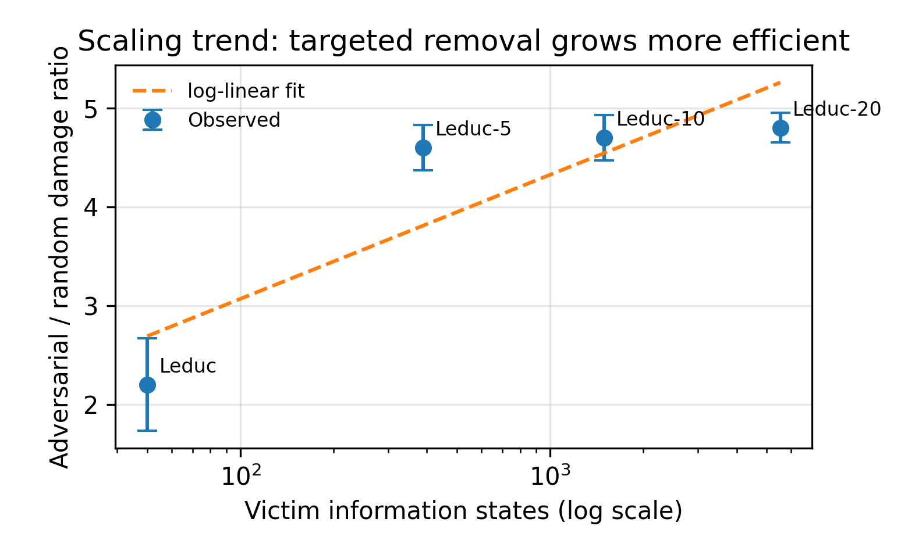
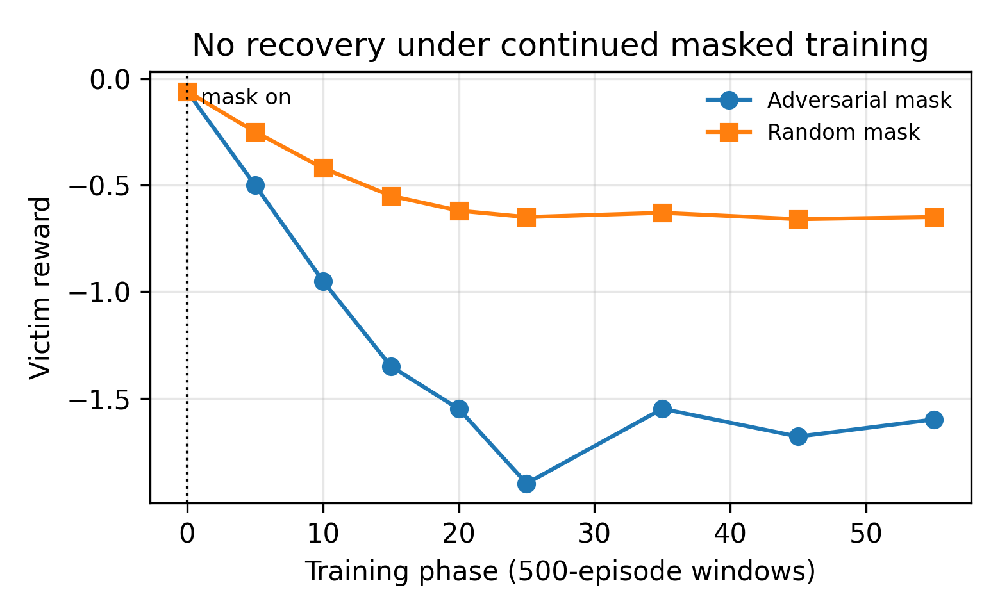

# When Actions Disappear: Adversarial Action Removal in Self-Play Reinforcement Learning

**Arahan Kujur**  
Independent Researcher  
`kujurarahan@gmail.com`

> This Markdown file is a GitHub-readable summary. The authoritative paper is the NeurIPS-style LaTeX draft in [`paper/latex/main.tex`](latex/main.tex), with compiled PDF at [`paper/latex/main.pdf`](latex/main.pdf).

## Abstract

We study **adversarial action removal** in self-play reinforcement learning: an attacker selectively removes legal actions from a victim's action set before action selection. Unlike observation or action perturbations, removal changes the feasible action set itself. Across poker games scaling from Kuhn (6 information states) to Leduc-20 (5,531), plus two non-poker domains, learned masking is substantially more damaging than random masking and learned perturbation baselines. The attack persists across Q-learning, PPO, NFSP, neural NFSP, and DQN victims. We connect the mechanism to reach-weighted and value-weighted contingent action capacity (`CAC_w`, `CAC_v`), showing that targeted removal at high-reach, high-value-gap states causes persistent collapse.

## Main Claim

Self-play RL agents are brittle to **targeted elimination of decision options**. Preserving raw action count is not enough; robustness depends on retaining strategically important choices at high-reach states.

## Contributions

- Formalizes adversarial action removal as a bi-level optimization over legal-action masks.
- Shows learned removal is more damaging than random masking and learned perturbation under matched training budgets.
- Scales evaluation from 6 to 5,531 victim information states.
- Tests tabular and neural victims: Q-learning, PPO, NFSP, neural NFSP, and DQN.
- Adds two non-poker domains: competitive gridworld and resource collection.
- Introduces `CAC_w` and `CAC_v` as interpretable mechanisms for strategic decision-capacity loss.
- Includes reviewer-response controls: public-only adversary, matched-L0 random, CACv-greedy oracle, separate-network DQN, mask timing, and mask-robust training baselines.

## Key Results

### Scaling

| Game | Victim Info States | Victim | Adversarial / Random Damage |
|---|---:|---|---:|
| Leduc | ~50 | DQN | 2.2x |
| Leduc-5 | 389 | DQN | 4.6x |
| Leduc-10 | 1,496 | DQN | 4.7x |
| Leduc-20 | 5,531 | DQN | 4.8x |



### No Recovery

Victims do not recover under continued masked training. In Leduc, evaluation-only masking already degrades a normally trained victim, while continued and mask-aware training converge to larger losses.

| Protocol | Victim Reward |
|---|---:|
| No mask | `+0.05 +/- 0.03` |
| Evaluation-only mask | `-0.58 +/- 0.18` |
| Continued masked training | `-2.65 +/- 0.30` |
| Mask-aware training from scratch | `-2.71 +/- 0.26` |



### Matched-L0 Fairness

The learned adversary does not win by masking more states. Under a strict matched-L0 control in Leduc:

| Mask | Effective k | Victim Reward |
|---|---:|---:|
| Adversarial | `64.8 +/- 4.3` | `-2.32 +/- 0.36` |
| Matched random | `64.8 +/- 4.3` | `-1.03 +/- 0.24` |

The advantage is **which states** are targeted, not how many.

### Public vs Private Information

Private victim information strengthens the attack but is not required.

| Adversary Information | Victim Reward |
|---|---:|
| None | `+0.05 +/- 0.03` |
| Random mask | `-0.98 +/- 0.08` |
| Public info only | `-1.71 +/- 0.58` |
| Private info | `-2.30 +/- 0.39` |

### Defense Baselines

| Defense | Victim Reward Under Attack |
|---|---:|
| Standard training | `-2.45 +/- 0.60` |
| Stochastic action dropout | `-1.82 +/- 0.31` |
| Random mask ensemble | `-2.64 +/- 0.54` |

Random unavailability is not enough; defenses likely need to preserve capacity at high-`CAC_v` states.

## Method Summary

An adversary defines a mask:

```text
M(info_state, legal_actions, player) -> retained_actions
```

The mask must retain at least one legal action. By default, the adversary removes exactly one action per masked state or chooses a no-op. In low-arity games this may force singleton action sets; in larger action spaces it leaves multiple alternatives.

Training alternates:

1. **Inner loop**: victim trains under the current mask.
2. **Outer loop**: adversary updates its removal policy using REINFORCE with reward `-victim_reward`.

## Mechanism: CACw and CACv

`CAC_w` measures remaining decision capacity weighted by reach probability:

```text
CAC_w = sum_h rho(h) * 1[more than one action remains at h]
```

`CAC_v` additionally weights by the value gap between the best action and the forced remaining action:

```text
CAC_v = sum_h rho(h) * delta(h) * 1[more than one action remains at h]
```

Empirically, `CAC_v` correlates better with victim reward than `CAC_w`, and a CACv-greedy oracle outperforms random masking.

## Scope and Limitations

- The attack is defined for **discrete action spaces**.
- Continuous-action analogues would require region exclusion rather than action removal.
- Theory provides local/sufficient bounds, not a full characterization of the global optimal adversary.
- Larger real-world benchmarks and stronger mask-aware defenses remain open directions.

## Reproducibility

All major experiments are standalone scripts under [`../experiments`](../experiments):

- `leduc20_scale.py` - largest scaling experiment
- `neural_nfsp_leduc5.py` - neural NFSP
- `reviewer_strengthening.py` - public-info, CACv oracle, L0 diagnostics, separate-network DQN, dropout
- `matched_l0_control.py` - strict matched-L0 random baseline
- `mask_timing_controls.py` - evaluation-only and mask-aware victim controls
- `mask_ensemble_defense.py` - mask-ensemble defense
- `generate_neurips_figures.py` - paper figures

The LaTeX appendix contains hyperparameters, normalization bounds, additional ablations, and learning-curve details.
